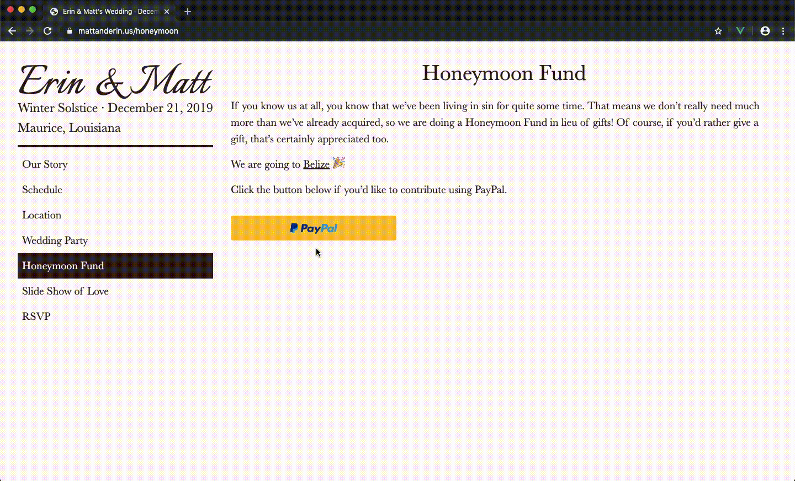
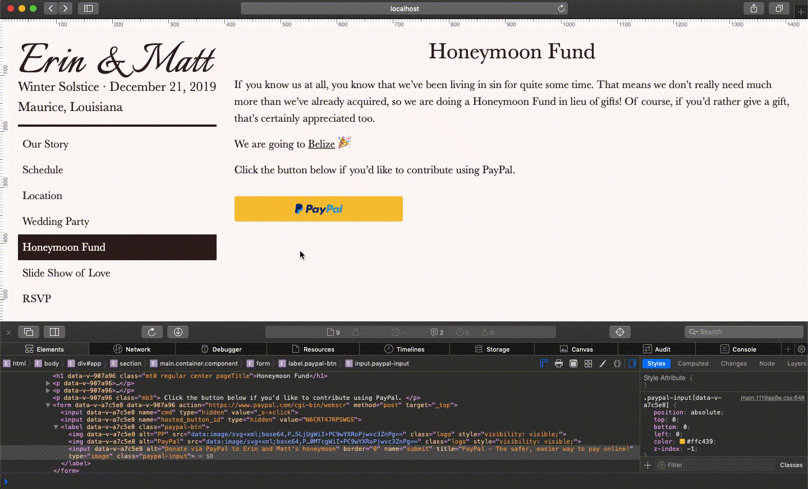
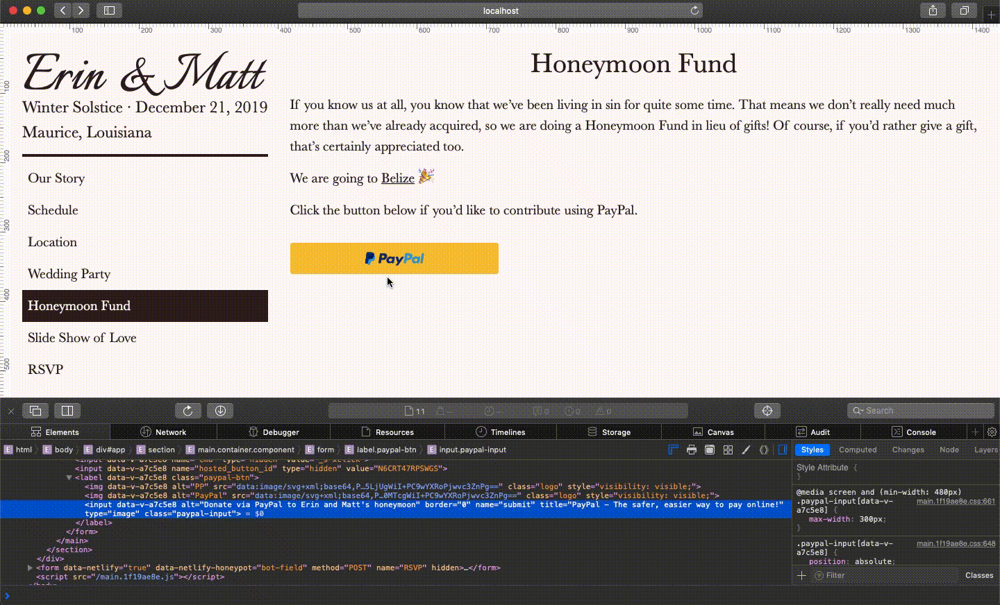

# 1. Changelog

All notable changes to this project will be documented in this file.

The format is based on [Keep a Changelog](https://keepachangelog.com/en/1.0.0/), and this project adheres to [Semantic Versioning](https://semver.org/spec/v2.0.0.html).

## 1.1. [v1.1.1] 2019-10-15

### 1.1.1. Meta

- branch: paypal-chrome
- description: Fix the broken image UI shown on Chrome when the paypal button is hovered (this happens since the input has type="image" but no src attribute, although no other browsers that I tested on renders the broken image UI).

### 1.1.2. Screenshots

BEFORE



AFTER


### 1.1.3. Updated

- img/1x1-transparent-pixel.png: Add my own 1x1 pixel image instead of using [paypal's tracer gif](https://www.paypal.com/en_US/i/scr/pixel.gif) that was part of their default [donate button embed code](https://github.com/brianzelip/mattanderin.us/commit/911c0b658f255116e42ebe4809142177af37bd6f#diff-7b5db8f9829c3d6b8467626fd2559226R36)
- TheHoneymoonFundDonateBtn.vue: dynamically bind the local pixel to .paypal-input, since for some reason Parcel wasn't handling the image provided by the src attribute (maybe some sort of issue since it's src on an input element?!)

## 1.2. [v1.1.0] 2019-10-15

### 1.2.1. Meta

- branch: router-scroll
- description: Update router to scroll to top of page on route push, and keep position history on use of browser back/forward buttons

### 1.2.2. Updated

- router.js:
  - Add `scrollBehavior` to router, using [the example from the docs](https://router.vuejs.org/guide/advanced/scroll-behavior.html), which returns `savedPosition` if it exists, and returns scroll coordinates to top of page if no savedPosition (ie: `{ x: 0, y: 0 }`)
  - Delete commented out code
- TheOurStory.vue: Add space character after comma in copy

## 1.3. [v1.0.4] 2019-10-15

### 1.3.1. Meta

- branch: paypal
- description: Fix the wierd blue border that renders around .paypal-input on hover

### 1.3.2. Screenshots

BEFORE



AFTER




### 1.3.3. Updated

- TheHoneymoonFundDonateBtn.vue: Add height and width styles from .paypal-btn to .paypal-input to explicitly set the input dimensions so that the weird blue border that renders on hover is out of the way as much as possible

## 1.4. [v1.0.3] 2019-10-15

### 1.4.1. Meta

- branch: master
- description: Add pic of Jessica to wedding party page

### 1.4.2. Added

- img/Jessica.jpg

### 1.4.3. Updated

- TheWeddingParty.vue: Add figure w/ Jessica pic

## 1.5. [v1.0.2] 2019-10-14

### 1.5.1. Meta

- branch: dev
- description: Adjust the honey moon fund page content

### 1.5.2. Updated

- TheHoneymoonFund.vue: Adjust markup content
- TheRSVP: Remove some markup content
- TheRSVPSuccess: Adjust markup content

### 1.5.3. Deleted

- TheHeroImageControl.vue

## 1.6. [v1.0.1] 2019-10-14

### 1.6.1. Meta

- branch: location
- description: Add location content to page

### 1.6.2. Updated

- TheLocation.vue:
  - Add content from google drive
  - get related images from the web
  - add content as data props
  - import an array of images objects in order to render the Parcel-manipulated image filenames in the build process, see [this GitHub issues comment](https://github.com/parcel-bundler/parcel/issues/1668#issuecomment-402627440)
  - Abstracted map iframe into its own component
- TheSlideShowOfLove: Update spotify iframe with M's playlist src
- TheWeddingParty: Add Gabe's nickname
- humans.txt: Add stack info

### 1.6.3. Added

- img/location/**.**
- TheLocationMap.vue

## 1.7. [v1.0.0] 2019-10-12

### 1.7.1. Meta

- branch: dev
- description: ceremony for shipping v1.0.0 MVP 🚢 🎉

### 1.7.2. Updated

- package\*: Update version number

## 1.8. [v0.18.1] 2019-10-12

### 1.8.1. Meta

- branch: schedule
- description: Add schedule data and markup

### 1.8.2. Updated

- TheSchedule.vue: Add data and markup
- TheHoneymoonFund.vue: Fix component name DOH!

## 1.9. [v0.18.0] 2019-10-12

### 1.9.1. Meta

- branch: donate
- description: Implement paypal button

### 1.9.2. Added

- TheHoneyMoonFundDonateBtn.vue:
  - embed E's donate via paypal code
  - customize paypal donate now button by:
    - adding a `<label>` wrapper positioned relative
    - removing the `<input type="image">`'s `src` attribute, and position absoluting the alt text with transparent color so that it takes up the same space as the label
    - Use data uri-based images inside the label for paypal logos via [their docs](https://developer.paypal.com/docs/checkout/?mark=customize%20button#try-the-buttons)

### 1.9.3. Updated

- TheHoneyMoonFund.vue:
  - tweak markup
  - import donate button component
- ThePage: abstract page link styles here since now we have two pages w/ links
- TheWeddingParty: remove unnecessary link styles

## 1.10. [v0.17.6] 2019-10-11

### 1.10.1. Meta

- branch: content-updates
- description: Update contents based on vid chat w/ M & E

### 1.10.2. Updated

- TheRSVP: Finalize the form in sync with the physical invites
- TheOurStory: Add mustache pic and swap out cafe cottage for wild salmon
- ThePage: Add a `<keep-alive>` wrapper to the dynamic component to keep RSVP form data alive if the user navigates to a different page after inputting some data
- TheWeddingParty: Minor tweaks

## 1.11. [v0.17.5] 2019-10-09

### 1.11.1. Meta

- branch: edits
- description: Implement some edits made to content

### 1.11.2. Updated

- TheOurStory:
  - add responsive photo
  - tweak markup and images layouts
  - edit content
- TheHoneyMoonFund: edit content

## 1.12. [v0.17.4] 2019-10-08

### 1.12.1. Meta

- branch: dev
- description: Adjust images on TheWeddingParty.vue

### 1.12.2. Updated

- TheWeddingParty.vue:
  - Add borders to all images
  - Set box-sizing on img (fix the bug where images jetted out to the right beyond the wrapping &lt;section&gt; line)

## 1.13. [v0.17.3] 2019-10-08

### 1.13.1. Meta

- branch: cleanup2
- description: clean up some more

### 1.13.2. Added

- parcel-plugin-static-files-copy: Installed dev-dependency

### 1.13.3. Updated

- index.html:
  - Remove unused google fonts
  - add link rel="author" to my homepage
- humans.txt: Move to static directory to be copied as-is to parcel's dist dir by parcel-plugin-static-files-copy
- TheHeader.vue: Instead of toggling 'winter solstice' after the smallest breakpoint, abbreviate December instead to always be showing winter solstice
- TheOurStory.vue:
  - Add text content
  - Find and add two related photos, embedded in a responsive figure with figcaption, and outline
  - Style the initial letter of the first paragraph
- TheOurStory, TheWeddingParty, TheHoneyMoonFund, TheRSVP: Swap out plain text double and single quotes with html entities for better looking typography

## 1.14. [v0.17.2] 2019-10-07

### 1.14.1. Meta

- branch: cleanup
- description: clean up some odds and ends

### 1.14.2. Updated

- ThePage.vue: Bump up base text sizes (p, label, button) responsively
- TheRSVP.vue: Update copy text, bump up text size, add signature
- TheHoneyMoonFund.vue: Make body copy consistent with other pages
- img/slideshow/: Rotate images, at the Exif level via GIMP-2.1.0 when prompted when opening each of the 5 images, for proper rendering

## 1.15. [v0.17.1] 2019-10-07

### 1.15.1. Meta

- branch: ms-scrollbar
- description: The MS Windows environment automatically puts a scroll bar on TheNav.vue because of the `overflow-y: scroll` rule. Let's hide that shit via a :hover psuedo class, as suggested by [this !so answer](https://stackoverflow.com/a/24911864/2145103).

### 1.15.2. Updated

- TheNav.vue: set `overflow-y: scroll` only when hovering over the <ul> and when max-height is 570px

## 1.16. [v0.17.0] 2019-10-07

### 1.16.1. Meta

- branch: heros
- description: Make multiple responsive heros, load a random one on page load

### 1.16.2. Screenshots

Here's what the work of this feature branch looks like:


### 1.16.3. Updated

- TheHero.vue: make 6 responsive heros via css classes; load a random one on page load

### 1.16.4. Added

- img/\*-flipped.jpg: Flip some images for responsive layout

## 1.17. [v0.16.0] 2019-10-07

### 1.17.1. Meta

- branch: hero
- description: Ship at least one responsive hero image for the landing page

### 1.17.2. Screenshots


### 1.17.3. Updated

- TheHero.vue: Use 3-value syntax for `background-position` and orientation media features to achieve the desired responsivity of the home page background image. This branch can be 🚢 🎉
- TheNav.vue
  - Make vertically scrollable at the wide and short viewport when the viewport is shorter than the header + nav content, use of `overflow-y: scroll` on the absolutely positioned ul from [this !so answer](https://stackoverflow.com/a/34172113/2145103)
- TheHeader & TheNav: Make <header> as tall as desktop viewport height, and then make TheNav scrollable when TheNav has overflow-y because the desktop viewport height is shorter than allows for TheNav's content.
  - The above work was undergone so that TheNav is accessible when there is not enough content in ThePage to force a vertical scroll. ie: This work addresses the other wonky case where there is a short and wide screen, like this CSS in ThePage.vue:
  ```css
  @media screen and (min-width: 960px) {
    .header {
      flex-shrink: 0;
    }
  }
  @media screen and (min-width: 960px) and (min-height: 550px) {
    .header {
      position: sticky;
      top: 0;
      align-self: flex-start;
    }
  }
  ```
  - Now on TheHero, and TheHoneyMoonFund, the nav is still accessible on short and wide.

## 1.18. [v0.15.0] 2019-10-05

### 1.18.1. Meta

- branch: audio
- description: Embed a responsive spotify playlist

### 1.18.2. Updated

- TheSlideShowOfLove.vue: Add spotify embed iframe

## 1.19. [v0.14.0] 2019-10-05

### 1.19.1. Meta

- branch: slideshow-improved
- description: Replace the base slideshow page with a masonry grid of all of the slideshow images, like TheSlideShowGallery.vue. Each image should be a card of sorts, that slightly animates on hover, and opens up a full screen modal of the image if clicked. When in the modal, the navigation buttons allow the user to scroll through the list of photos, like TheSlideShowOfLove.vue as handed off from v0.13.0.

### 1.19.2. Updated

- TheSlideShowGallery.vue:

  - Got responsive masonry layout working, using the `gutter` option. HUGE THANKS to [this !SO answer](https://stackoverflow.com/a/51290967/2145103) for providing the algorithm needed to make masonry's responsive element sizing with gutter work! Here's the secret sauce:

  ```
  //pseudocode

  $number_of_cols = 3; //for example
  $column_width = 100 / $number_of_cols; //a float value, e.g. 33.33333333 in this example
  $item_width_diff = $gutter * ($number_of_cols - 1) / $number_of_cols; //in this example: 10*2/3 = 6.6666666

  then in your css you would have

  .grid-item {
    width: calc($column_width - $item_width_diff);
  }
  ```

  - used some card hover and scale3d() styles from [this codepen](https://codepen.io/jasonheecs/pen/GNNwpZ) for `.hover-shadow`
  - renamed file TheSlideShowOfLove.vue
  - show modal when an images is clicked
  - Listen for the escape key while the modal is showing to close the modal, using a method and `created()` and `destroyed()`, , via https://vuejsdevelopers.com/2017/05/01/vue-js-cant-help-head-body/. (I bought this dude a coffee as a result of this post ☕ 🎉)
  - Listen for left/right arrow keydown presses from user, then send this data to modal child via prop (ie: I just build a carousel that can be advanced via mouse and keyboard!)
  - Always be showing the heart cursor
  - send image data, including the index to start at, to the modal

* TheSlideShowOfLove.vue:
  - Renamed TheSlideShowOfLoveModal.vue
  - Make modal full screen fixed position
  - implement close button
  - listen for vanilla js defined keydown events from parent for advancing the carousel back and forward
  - refactors around image data and index to start showing via props
  - Always be showing the heart cursor

JUST BUILT MY FIRST REAL CAROUSEL! Here's what it looks like:


## 1.20. [0.13.0] - 2019-10-03

### 1.20.1. Meta

- branch: slideshow
- description: Implement mvp custom slideshow based on my quick and dirty hero carousel. M's feedback asked about "making it full screen". So what I'm planning to do is ship this branch, then start another where the idea is to combine TheSlideShowGallery.vue and a modal component that opens at whichever image the user clicked on from the gallery, and that allows the user to scroll through the rest of the gallery images, all presented in high def full screen.

### 1.20.2. Added

- masonry-layout as dependency
- TheSlideShowGallery.vue: Used masonry to try a gallery layout, need to implement [imagesLoaded](https://imagesloaded.desandro.com/) as per the [masonry docs](https://masonry.desandro.com/layout.html#imagesloaded)

### 1.20.3. Updated

- TheSlideShow.vue: Renamed TheSlideShowOfLove.vue; implemented my own carousel from scratch! Screenshot:


## 1.21. [0.12.1] - 2019-09-27

### 1.21.1. Meta

- branch: dev
- description: Add more wedding party content from shared data
  - [photos](https://drive.google.com/drive/folders/1E747-zTgCDxZkHcus5s0jg0JG8JExmeD)
  - [text](https://docs.google.com/document/d/16_Llvm-oVSAyYiXIfDTX-_v11xQz9lYcSwpYAGcMS8k)

### 1.21.2. Added

- img/: Bridesmaids and groomsmen photos, plus the two hero images cropped by Matt

### 1.21.3. Updated

- TheWeddingParty.vue: Add new content markup and css selectors

## 1.22. [0.12.0] - 2019-09-26

### 1.22.1. Meta

- branch: party-layout
- description: Make a better wedding party layout for the images and text flow

### 1.22.2. Added

- humans.txt

### 1.22.3. Updated

- img/: Cropped out distracting content from a couple photos
- ThePage.vue: Control responsive font size from this parent component for all pages, not just wedding party
- TheWeddingParty: Control page-specific display and image flow, refactor font-sizing styles out to parent
- TheRSVP: Update prose, refactor out h2 font size to parent
- index.html: Add link to humans.txt

## 1.23. [0.11.0] - 2019-09-23

### 1.23.1. Meta

- branch: responsive
- description: Need to design the site's responsiveness to smaller devices.

In particular:

- the hero image and how it works with the header
- will likely need to make the home page header have a background color
- time to make my first real drop down header nav menu for mobile?

~~TheHero.html's background-position impacts the need for TheHeader's .bg-lighten class.~~

Decided to remove the .bg-lighten class in favor of making the buttons on hover have light text on dark background. This allows for the photo to take precedence and not have pesky unnatural color.

Deciding to play around with the main header and nav layout after looking through 3rd party wedding site templates, etc.

- thinking about a left top header and vertical left side navigation, which implies a vertical split of the overall desktop viewport into left and right panels, where the non-hero page content goes on the right side.

  - Refactored the header content into a single column div
    - changed the h1 font size and family to the body's Baskerville, but put it in italics
    - make two sets of h2 to stack on top of eachother
    - add an hr between headings and nav
    - display .button's as block to sharply define the single column on hover
  - I think this is a nice nav approach, looks nice with the large italic h1, with a nice simple design that has a bold line for break up and a branding based in popular book styles!
  - Have to figure out how to handle all header text color on each hero context
  - Made the easiest (ie: least code, least fighting against the browser) flex header & page layout, with sticky header, and an inline-block (on Hero) - like effect between header and page via commit #1577a613b
  - Am going with a menu button approach to mobile, as well as abbreviating headings innerHTML on mobile too. Have to figure out the menu page overlay when menu button is clicked.
  - Added the menu overlay, which slides out from the right side. Used https://firefly-iii.org/ as a reference, which is similar to the w3schools' "Sidenav overlay", but uses margin and negative margin instead of width to show and hide the overlay.
    - There's a problem with the menu closing when on the home page and another page is selected. Since the hero and the pages are currently different router views, the menu closing from the hero page when a page is clicked is not a smooth sliding close, but an abrupt disappearing close. Making the hero a page could work - just have to figure out how to make the background image wrapper come after the <header>, whereas on the current hero, the <header> is a child of the background-image wrapper. [problem fixed as of commit b5752808]
  - Had to make the nav menu a two column layout to avoid the problem of overflowed menu items not showing up on mobile in horizontal mode. With the one column, the RSVP menu item could not be displayed since it fell beneath the viewport and is inside a fixed element. I tried to solve it using [this !SO answer for a 3 div implementation](https://stackoverflow.com/a/50976613/2145103), but it didn't work. So I decided to just go w/ the two column layout.
  - Decided to change the mobile nav menu button to have no text, and with a circle background around the hamburger a la material design.
  - Now that the mobile header is created for the smallest viewport, I need to make the next larger views:
    - bigger phone
    - tablet
    - then desktop
    - then larger desktop? (I think Matt has some wide monitors)
  - Commit at which the nav mobile header is right for smallest viewport: #5b13b8c4
  - Created the following breakpoints
    - screen and (min-width: 480px)
    - screen and (min-width: 780px)
    - screen and (min-width: 960px)
    - screen and (min-width: 1024px)
    - screen and (min-width: 960px) and (min-height: 550px)
  - Commit #facc00fbc contains what I think is the finalization of the responsive branch work 🎉
  - M & E like the Italianno font for the site <h1> better than the italicized Baskerville. The h1 font-size and margin-bottom needed tweaking with the different font at each breakpoint. See commit #862e8a729 for finalized design for review by M & E.
  - reverted the mobile nav toggle button to always have .bg-soft-black and .soft-white. The commit prior to this w/ the inverse colors on home page was #7778c1583.

### 1.23.2. Added

- TheNavMobile.vue: Trying different design ideas to make something. Instead, I've been liking some design examples from Squarespace, namely:
  - https://emily-vansant-mf3z.squarespace.com/
  - https://graceandtasa.squarespace.com/#home
  - http://www.fivesixseventeen.com/
  - https://aubrey-demo.squarespace.com/?nochrome=false
  - And getting some mobile flyout nav insight from https://www.w3schools.com/howto/howto_js_sidenav.asp#
- TheHeader2.vue: Horizontal header layout, with larger container, and nav items aligned in the middle horizontally with h1/h2
- TheHeader3.vue: Header layout from the top left down in vertical fashion
- TheNavHeader3.vue: Vertical nav layout in the top left corner
- Table of contents herein, via huntertran.auto-markdown-toc VS Code extension

### 1.23.3. Updated

- TheNav.vue:
  - Add box-shadow to sticky nav, via the homepage of the awesome [Tania Rascia](https://www.taniarascia.com/)
  - Update `button:hover`'s background color and color
- ALL FILES!

### 1.23.4. Deleted

- All files associated w/ the prior design iteration

## 1.24. [0.10.2] - 2019-08-14

### 1.24.1. Meta

- branch: dev
- description: Update page heights, let rsvp user know they will receive an email after submission

### 1.24.2. Updated

- all page components

## 1.25. [0.10.1] - 2019-08-14

### 1.25.1. Meta

- branch: dev
- description: Update the header h1 markup so that it is not a link on the home page. This stemmed from the fact that, after you clicked away from the initial hero image on the home page, then clicked the home page link, the hero image did not revert back to the initial hero image. This solution is easier then snaking custom event messages through the component tree.

### 1.25.2. Added

- TheHeaderH1.vue - abstracted h1 markup out of TheHeader

### 1.25.3. Updated

- TheHeader.vue - registered TheHeaderH1, and use v-if/else to conditionally put a router-link around the h1

## 1.26. [0.10.0] - 2019-08-14

### 1.26.1. Meta

- branch: hero-images
- description: There are a handful of images that would make good landing page heros. Let's update TheHero.vue so that Matt and Erin can toggle through the set of doable images. (aka, let's build a carousel!)

### 1.26.2. Added

- TheHeroImagesControl.vue

### 1.26.3. Updated

- TheHero.vue - created my first carousel in writing the control component, and writing the logic to traverse through a list 🎉
  - I also came across the unfortunate experience of using inline style bindings to set background-image does not work. Not sure if the problem is vue or parcel. When you bind inline styles, the url to the image does not get updated to the new built url; when you set it via normal html attr inline styles (no binding), or via a style block, then the bg image is set.

## 1.27. [0.9.1] - 2019-08-13

### 1.27.1. Meta

- branch: dev
- description: The smaller honey form footprint does not work :(. I say this because the form fields in the netlify forms dashboard are all blank.
  I'm going to reput the honey form into index.html to fix this

### 1.27.2. Deleted

- TheRSVPHoneyForm.vue

### 1.27.3. Updated

- index.html
- TheRSVP.vue

## 1.28. [0.9.0] - 2019-08-13

### 1.28.1. Meta

- branch: email
- description: Update the email response sent after RSVP submission

### 1.28.2. Added

- TheRSVPHoneyForm.vue

### 1.28.3. Updated

- zapier zap
- index.html: removed hidden form for netlify
- TheRSVP.vue: add hidden form for netlify (thereby only writing the form on one html page)

## 1.29. [0.8.0] - 2019-08-13

### 1.29.1. Meta

- branch: dev
- description: Add user email to RSVP form flow

### 1.29.2. Updated

- TheRSVP.vue - add email section markup and logic
- index.html - add email input

## 1.30. [0.7.0] - 2019-08-13

### 1.30.1. Meta

- branch: submit
- description: Form isn't working yet - need to keep going with [the tutorial](https://www.netlify.com/blog/2018/09/07/how-to-integrate-netlify-forms-in-a-vue-app/) (tl;dr need to refactor around Vue controlling the form and route push on submit)

### 1.30.2. Added

- TheRSVPFail.vue
- TheRSVPSuccess.vue

### 1.30.3. Updated

- index.html: adding a hidden form with the inputs was key to getting Netlify forms to read the data. Before this change, netlify recognized a submission, but there was no data. [This !so answer](https://stackoverflow.com/a/49859661/2145103) helped out, (which I found via [this comment](http://disq.us/p/1yae84j) in the netlify forms and vue tutorial).
- TheRSVP.vue: this is where all the form data logic and POST happens

## 1.31. [0.6.0] - 2019-08-12

### 1.31.1. Meta

- branch: rsvp
- description: Get the RSVP form up and running
- have to pre-render in order for Netlify forms to work, see https://www.netlify.com/blog/2018/09/07/how-to-integrate-netlify-forms-in-a-vue-app/

### 1.31.2. Added

- parcel-plugin-prerender
- .prerenderrc

### 1.31.3. Updated

- package\*
- TheRSVP.vue: Add form
- TheNav.vue: Update the sticky nav background color, from transparent to soft-white; now there's no visual conflict between the sticky nav and the scrolling text beneath it.
- TheWeddingParty.vue: use better semantic element for the italicized "fast forward", from `<strong class="italic">`, to `<em>`, to the better `<i>`; see https://developer.mozilla.org/en-US/docs/Web/HTML/Element/em#%3Ci%3E_vs._%3Cem%3E

## 1.32. [0.5.0] - 2019-08-11

### 1.32.1. Meta

- branch: wedding-party
- description: Let's incorporate the available images and text

### 1.32.2. Updated

- TheWeddingParty.vue

## 1.33. [0.4.0] - 2019-08-11

### 1.33.1. Meta

- branch: pages
- description: Now that we've worked out the nav categories, make a page for each category. This will allow us to easily add an active class to the nav button for each page

### 1.33.2. Added

- TheOurStory.vue
- TheSchedule.vue
- TheLocation.vue
- TheWeddingParty.vue
- TheHoneymoonFund.vue
- TheSlideShow.vue
- TheRSVP.vue

## 1.34. [0.3.0] - 2019-08-06

### 1.34.1. Meta

Erin's going the various pages route (instead of the one-long-page route); this means making a sticky header that is imported only once, and works no matter what other components are, or are not, rendered.

There's a problem with serious scroll jank when rendering the current `<TheHeader>` independent of `<TheHero>`. Here's why:

> The [fixed] element is removed from the normal document flow, _and no space is created for the element in the page layout_.

- https://developer.mozilla.org/en-US/docs/Web/CSS/position#Values

So, the element is there, get's fixed, then disappears so there's a scroll, but then it reappears since offSetTop, then it disappears, then it reappears, etc. Hence the scroll jank.

FIXED by simply adding some bottom margin to the `<header>`!

### 1.34.2. Added

- router.js
- ThePage.vue
- TheBridalParty.vue
- TheHoneyMoon.vue

### 1.34.3. Updated

- TheNav.vue
- TheHeader.vue
- main.js

## 1.35. [0.2.0] - 2019-08-04

### 1.35.1. Meta

- branch: dev
- reason:
  - dev branch will stick arond, to show Erin and Matt the progress and discuss future moves
  - this will get merged with master, to allow for the Vue build to happen on the staging branch to allow it to render the vue app; so when dev work is done, the Splash.vue component will get swapped out for the App.vue component in main.js

### 1.35.2. Added

- Vue architecture, and early design draft

## 1.36. [0.1.1] - 2019-05-27

### 1.36.1. Added

- CHANGELOG.md

<!-- TOC -->

- [Changelog](#changelog)
  - [[v1.1.1] 2019-10-15](#v111-2019-10-15)
    - [Meta](#meta)
    - [Screenshots](#screenshots)
    - [Updated](#updated)
  - [[v1.1.0] 2019-10-15](#v110-2019-10-15)
    - [Meta](#meta)
    - [Updated](#updated)
  - [[v1.0.4] 2019-10-15](#v104-2019-10-15)
    - [Meta](#meta)
    - [Screenshots](#screenshots)
    - [Updated](#updated)
  - [[v1.0.3] 2019-10-15](#v103-2019-10-15)
    - [Meta](#meta)
    - [Added](#added)
    - [Updated](#updated)
  - [[v1.0.2] 2019-10-14](#v102-2019-10-14)
    - [Meta](#meta)
    - [Updated](#updated)
    - [Deleted](#deleted)
  - [[v1.0.1] 2019-10-14](#v101-2019-10-14)
    - [Meta](#meta)
    - [Updated](#updated)
    - [Added](#added)
  - [[v1.0.0] 2019-10-12](#v100-2019-10-12)
    - [Meta](#meta)
    - [Updated](#updated)
  - [[v0.18.1] 2019-10-12](#v0181-2019-10-12)
    - [Meta](#meta)
    - [Updated](#updated)
  - [[v0.18.0] 2019-10-12](#v0180-2019-10-12)
    - [Meta](#meta)
    - [Added](#added)
    - [Updated](#updated)
  - [[v0.17.6] 2019-10-11](#v0176-2019-10-11)
    - [Meta](#meta)
    - [Updated](#updated)
  - [[v0.17.5] 2019-10-09](#v0175-2019-10-09)
    - [Meta](#meta)
    - [Updated](#updated)
  - [[v0.17.4] 2019-10-08](#v0174-2019-10-08)
    - [Meta](#meta)
    - [Updated](#updated)
  - [[v0.17.3] 2019-10-08](#v0173-2019-10-08)
    - [Meta](#meta)
    - [Added](#added)
    - [Updated](#updated)
  - [[v0.17.2] 2019-10-07](#v0172-2019-10-07)
    - [Meta](#meta)
    - [Updated](#updated)
  - [[v0.17.1] 2019-10-07](#v0171-2019-10-07)
    - [Meta](#meta)
    - [Updated](#updated)
  - [[v0.17.0] 2019-10-07](#v0170-2019-10-07)
    - [Meta](#meta)
    - [Screenshots](#screenshots)
    - [Updated](#updated)
    - [Added](#added)
  - [[v0.16.0] 2019-10-07](#v0160-2019-10-07)
    - [Meta](#meta)
    - [Screenshots](#screenshots)
    - [Updated](#updated)
  - [[v0.15.0] 2019-10-05](#v0150-2019-10-05)
    - [Meta](#meta)
    - [Updated](#updated)
  - [[v0.14.0] 2019-10-05](#v0140-2019-10-05)
    - [Meta](#meta)
    - [Updated](#updated)
  - [[0.13.0] - 2019-10-03](#0130---2019-10-03)
    - [Meta](#meta)
    - [Added](#added)
    - [Updated](#updated)
  - [[0.12.1] - 2019-09-27](#0121---2019-09-27)
    - [Meta](#meta)
    - [Added](#added)
    - [Updated](#updated)
  - [[0.12.0] - 2019-09-26](#0120---2019-09-26)
    - [Meta](#meta)
    - [Added](#added)
    - [Updated](#updated)
  - [[0.11.0] - 2019-09-23](#0110---2019-09-23)
    - [Meta](#meta)
    - [Added](#added)
    - [Updated](#updated)
    - [Deleted](#deleted)
  - [[0.10.2] - 2019-08-14](#0102---2019-08-14)
    - [Meta](#meta)
    - [Updated](#updated)
  - [[0.10.1] - 2019-08-14](#0101---2019-08-14)
    - [Meta](#meta)
    - [Added](#added)
    - [Updated](#updated)
  - [[0.10.0] - 2019-08-14](#0100---2019-08-14)
    - [Meta](#meta)
    - [Added](#added)
    - [Updated](#updated)
  - [[0.9.1] - 2019-08-13](#091---2019-08-13)
    - [Meta](#meta)
    - [Deleted](#deleted)
    - [Updated](#updated)
  - [[0.9.0] - 2019-08-13](#090---2019-08-13)
    - [Meta](#meta)
    - [Added](#added)
    - [Updated](#updated)
  - [[0.8.0] - 2019-08-13](#080---2019-08-13)
    - [Meta](#meta)
    - [Updated](#updated)
  - [[0.7.0] - 2019-08-13](#070---2019-08-13)
    - [Meta](#meta)
    - [Added](#added)
    - [Updated](#updated)
  - [[0.6.0] - 2019-08-12](#060---2019-08-12)
    - [Meta](#meta)
    - [Added](#added)
    - [Updated](#updated)
  - [[0.5.0] - 2019-08-11](#050---2019-08-11)
    - [Meta](#meta)
    - [Updated](#updated)
  - [[0.4.0] - 2019-08-11](#040---2019-08-11)
    - [Meta](#meta)
    - [Added](#added)
  - [[0.3.0] - 2019-08-06](#030---2019-08-06)
    - [Meta](#meta)
    - [Added](#added)
    - [Updated](#updated)
  - [[0.2.0] - 2019-08-04](#020---2019-08-04)
    - [Meta](#meta)
    - [Added](#added)
  - [[0.1.1] - 2019-05-27](#011---2019-05-27)
    - [Added](#added)

<!-- /TOC -->
